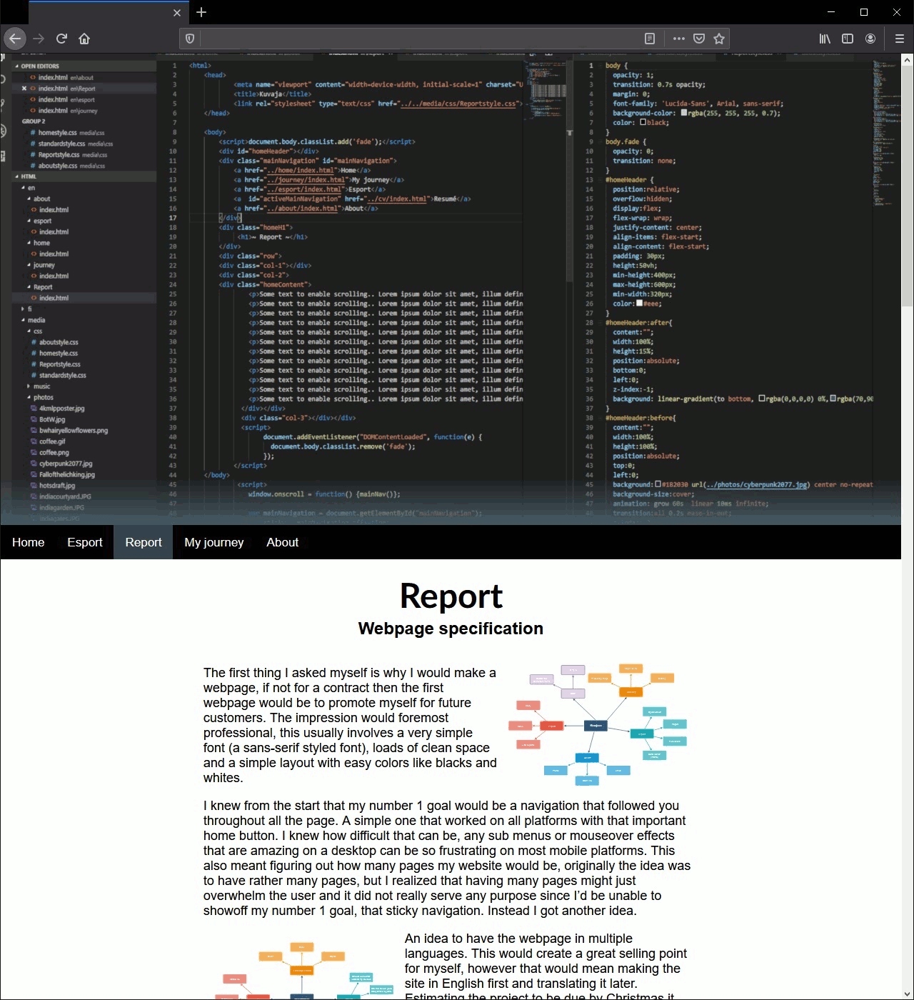

# Webbutveckling (2018)
###### PROJECT - Course Project
Final project in course Webbutveckling, which was the first course we took @Arcada in webdesign.
My only prior experience to this project was a small course in high school with <html> done with notepad and paperback instructions back in 2006.

## Installation
Just download and open!

## Preview

## Contribution
School project, won't be updated but cunstructive critizism is welcome.

